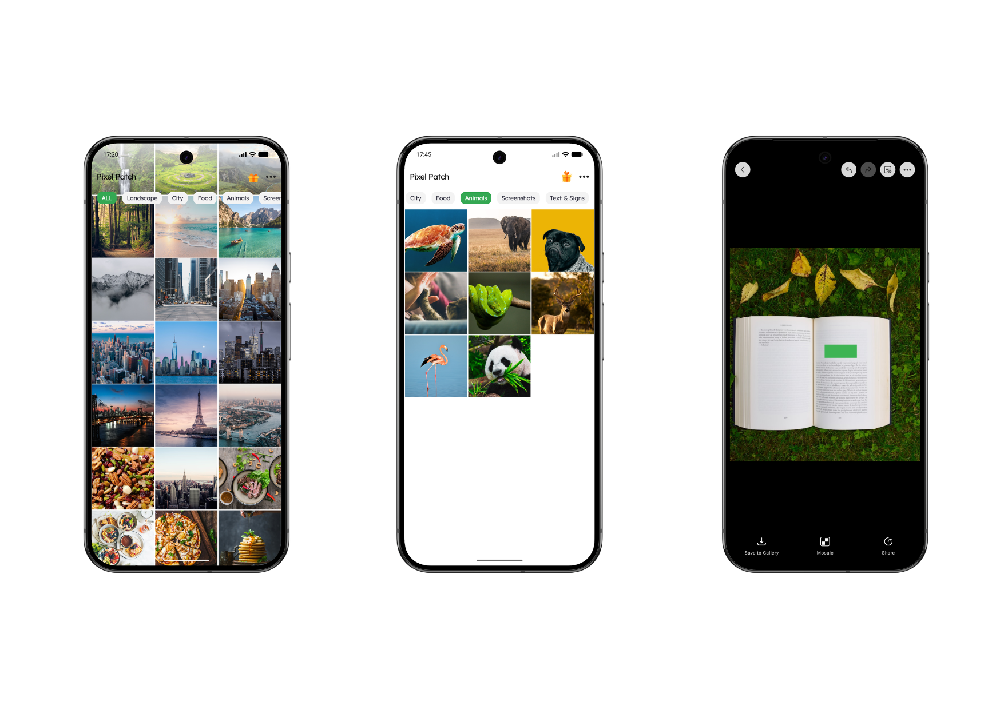

# PixelPatch (像素打碼)

[English](README.md) | [简体中文](README-zh.md) | [繁體中文](README-tw.md) | [日本語](README-ja.md)

---

    

 

### 📥 立即下載

---

## 📖 產品介紹

**PixelPatch (像素打碼)** 是保護您圖片隱私和進行智能圖像標註的終極工具。無論是對敏感信息進行模糊處理，還是添加自定義馬賽克效果，PixelPatch 都能讓一切變得快速、優雅且安全。

### ✨ 核心功能
- **智能文字識別 (OCR)**：秒級自動檢測並有效遮擋敏感文字內容。
- **馬賽克與像素化工具**：無縫模糊人臉、車牌及私人文檔。
- **動態主題適配**：全面支持夜間模式（Dark Mode）與多屏幕多端佈局。
- **無損畫質導出**：以原生畫質保存編輯後的照片。

---

## 📝 更新日誌

**v1.2.0 (2026-03-26)**
- 新增全面國際化支持，全新適配英語、日語及繁體中文。
- 優化渲染層性能，極大地解決了進入 `DiscernActivity` 頁面的卡頓問題。
- 重構彈窗與設置頁面的 UI，完美兼顧深色模式並改進長圖判定及交互邏輯。

**v1.1.0 (2026-03-22)**
- 徹底使用 Jetpack Compose 重構圖片標註界面（`DiscernScreen`）。
- 增強文本識別與打碼互動邏輯，支持長按細粒度選擇區塊。
- 新增 EXIF 信息快捷查看、設置應用偏好參數及統一的底部操作工具欄。

**v1.0.0**
- 初始版本發佈，帶來基於 OpenCV 的文本區域識別檢測系統與手動無極馬賽克筆刷工具。
